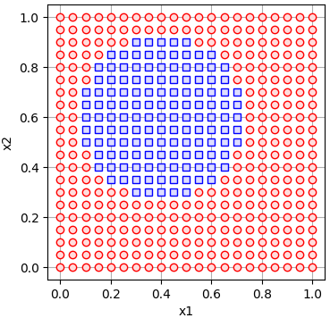

# lumpur
learn to use methods for processing unclear response


## features
+ `binary()`function in `lumpur.datasets.clasdata` module.
+ `plot_binary()` function in `lumpur.datasets.dataviz` module.
+ `abbr()` function in `lumpur.misc.info` module.


## examples
Following are some examples of lumpur.

### circular decision boundary
$$
0.41 - 0.8x - 1.2y + x^2 + y^2 = 0
$$

```py
import lumpur.datasets.clasdata as ldc
import lumpur.datasets.dataviz as ldv

coeffs = [[0.41], [-0.8, -1.2], [1, 0, 1]]
r1 = [0, 1.05, 0.05]
r2 = [0, 1.05, 0.05]
df = ldc.binary(coeffs, r1=r1, r2=r2)
ldv.plot_binary(df)
```


### linier decision boundary
$$
-x + y = 0
$$
```py
import lumpur.datasets.clasdata as ldc
import lumpur.datasets.dataviz as ldv

coeffs = [[0], [-1, 1]]
df = ldc.binary(coeffs)
ldv.plot_binary(df)
```


### lumpur abbreviation
```py
import lumpur.misc.info as info

print(info.abbrv())
```
```
learn to use methods for processing unclear response
```
