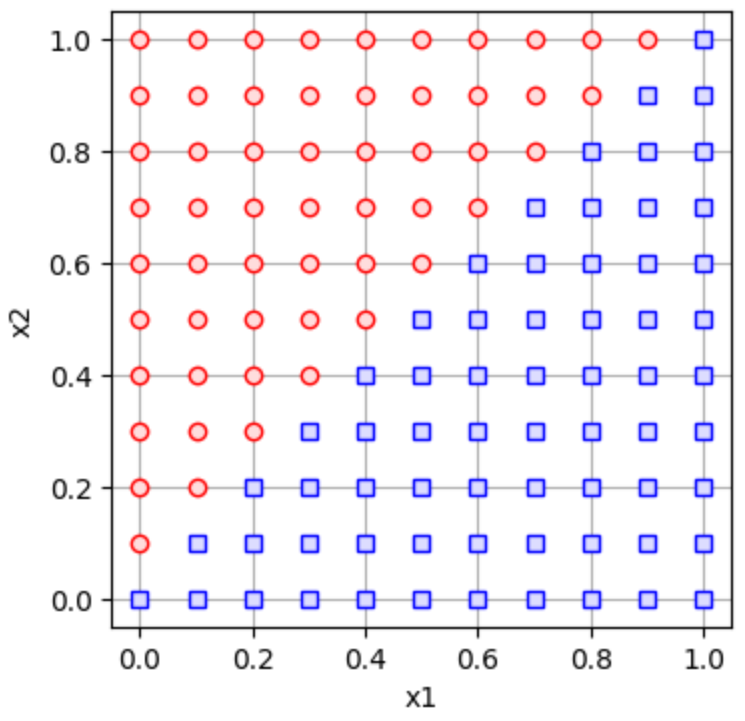

# lumpur
learn to use methods for processing unclear response


## features
+ `binary()`function in `lumpur.datasets.clasdata` module.
+ `plot_binary()` function in `lumpur.datasets.dataviz` module.
+ `abbr()` function in `lumpur.misc.info` module.


## examples
```py
import lumpur.datasets.clasdata as ldc
import lumpur.datasets.dataviz as ldv

coeffs = [[0], [-1, 1]]
df = ldc.binary(coeffs)
ldv.plot_binary(df)
```


```py
import lumpur.misc.info as info

print(info.abbrv())
```
```
learn to use methods for processing unclear response
```
